


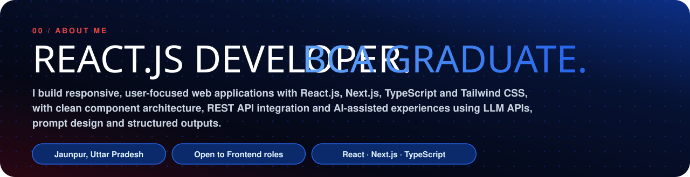

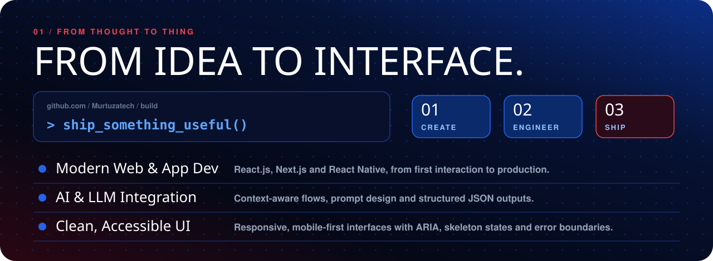

<a href="https://bp-track-q2l1.vercel.app/">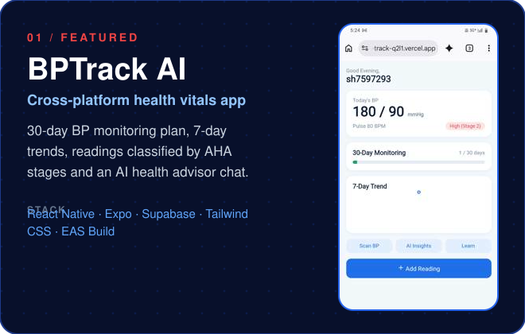</a>
<a href="https://help-radar-app.vercel.app/?hl=en-IN">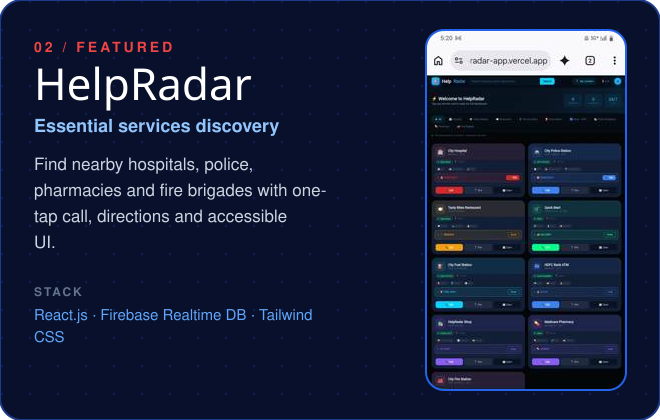</a>
<a href="https://fuel-find-app.vercel.app/">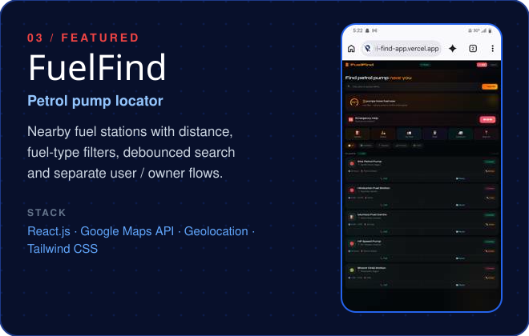</a>
<a href="https://ecommerce-react-project-16mn.vercel.app/">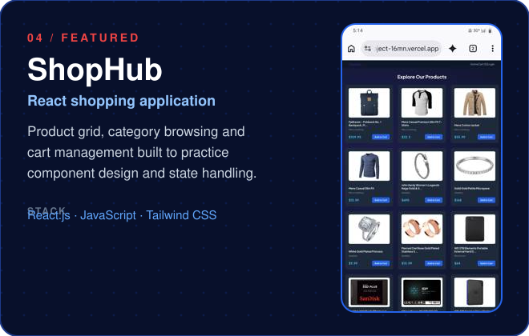</a>

| Project | Live Demo | Source Code |
|---|---|---|
| 🩺 BPTrack AI | [Open](https://bp-track-q2l1.vercel.app/) | [GitHub](https://github.com/Murtuzatech/BPTrack-Ai) |
| 🚨 HelpRadar | [Open](https://help-radar-app.vercel.app/?hl=en-IN) | [GitHub](https://github.com/Murtuzatech/HelpRadar) |
| ⛽ FuelFind | [Open](https://fuel-find-app.vercel.app/) | [GitHub](https://github.com/Murtuzatech/Fuel-find-app) |
| 🛒 ShopHub | [Open](https://ecommerce-react-project-16mn.vercel.app/) | [GitHub](https://github.com/Murtuzatech/ecommerce-react-project) |


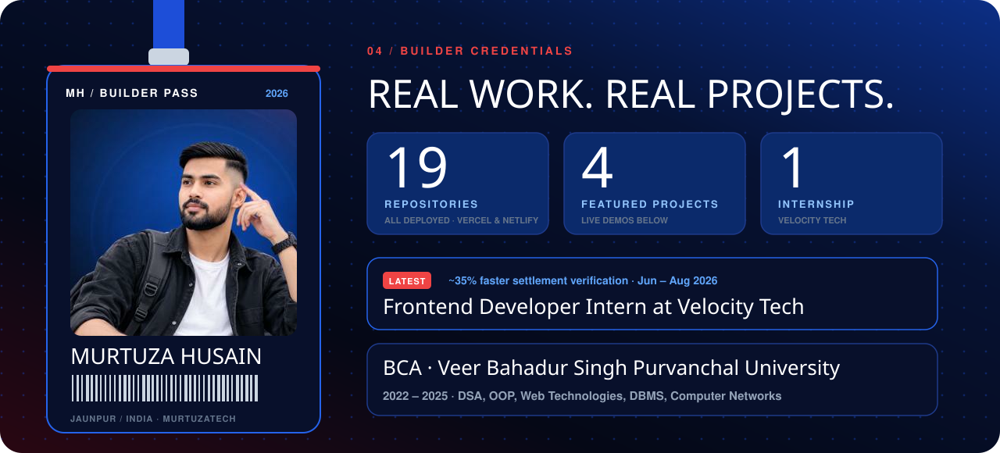

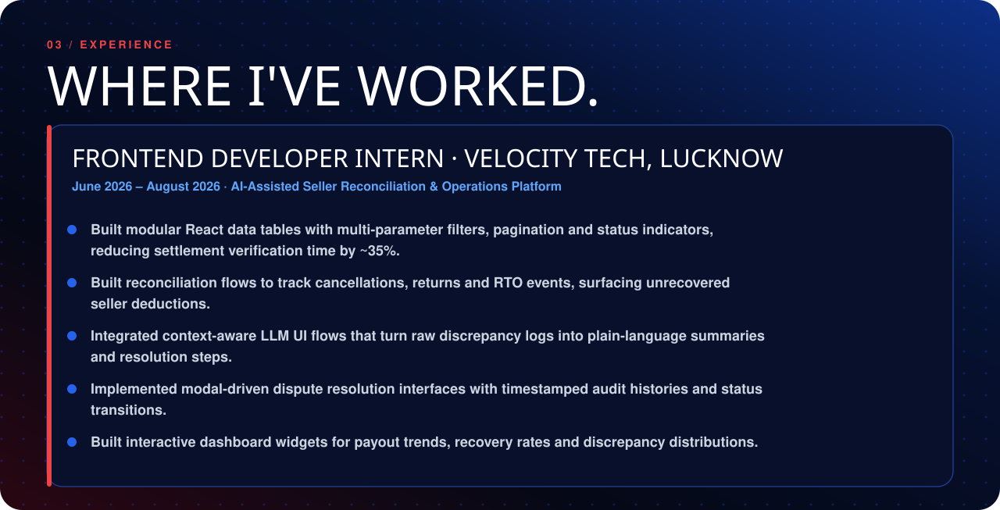

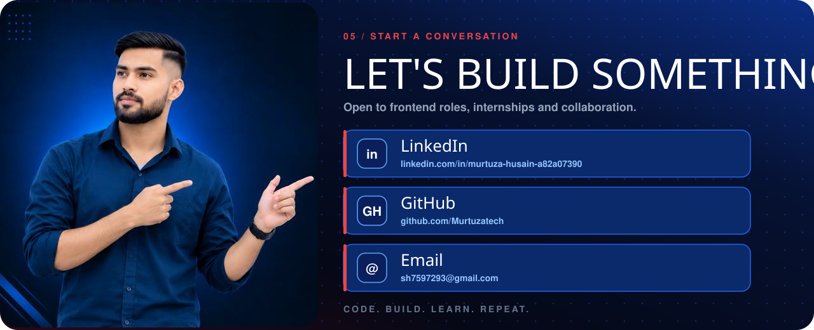

