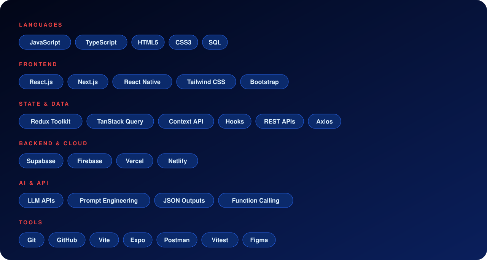

## 👋 Hi, I'm Murtuza
**React.js Developer | BCA Graduate | Building real-world web applications**

I build responsive, user-focused interfaces with React.js, Next.js, TypeScript, Tailwind CSS and modern frontend tools, with clean component architecture, REST API integration and AI-assisted experiences (LLM APIs, prompt design, structured outputs).

📍 Jaunpur, Uttar Pradesh, India &nbsp;|&nbsp; 💼 Open to Frontend Developer opportunities

## 🔥 Featured Projects

| Project | Live Demo | Source Code |
|---|---|---|
| 🩺 BPTrack AI | [Open](https://bp-track-q2l1.vercel.app/) | [GitHub](https://github.com/Murtuzatech/BPTrack-Ai) |
| 🚨 HelpRadar | [Open](https://help-radar-app.vercel.app/?hl=en-IN) | [GitHub](https://github.com/Murtuzatech/HelpRadar) |
| ⛽ FuelFind | [Open](https://fuel-find-app.vercel.app/) | [GitHub](https://github.com/Murtuzatech/Fuel-find-app) |
| 🛒 ShopHub | [Open](https://ecommerce-react-project-16mn.vercel.app/) | [GitHub](https://github.com/Murtuzatech/ecommerce-react-project) |

## 🧰 Tech Stack

## 💼 Experience
**Frontend Developer Intern, Velocity Tech, Lucknow** · *June 2026 – August 2026*
AI-Assisted Seller Reconciliation & Operations Platform
- Built modular React data tables with multi-parameter filters, pagination and status indicators, reducing settlement verification time by ~35%.
- Built reconciliation flows to track cancellations, returns and RTO events, surfacing unrecovered seller deductions.
- Integrated context-aware LLM UI flows that turn raw discrepancy logs into plain-language summaries and resolution steps.
- Implemented modal-driven dispute resolution interfaces with timestamped audit histories and status transitions.
- Built interactive dashboard widgets for payout trends, recovery rates and discrepancy distributions.

## 🎓 Education
**Bachelor of Computer Applications (BCA)**, Veer Bahadur Singh Purvanchal University, Jaunpur · *2022 – 2025*

## 🤝 Let's Connect

**"Code. Build. Learn. Repeat."**

